# Alpha Data Collector


**떡상** 서비스의 데이터 수집 및 지표 계산 모듈

> 떡상: 시나리오 기반 주식 투자 전략 서비스

---

## 목차

- [프로젝트 소개](#프로젝트-소개)
- [기술 스택](#기술-스택)
- [시스템 아키텍처](#시스템-아키텍처)
- [프로젝트 구조](#프로젝트-구조)
- [데이터베이스 설계](#데이터베이스-설계)
- [주요 기능](#주요-기능)
- [API 엔드포인트](#api-엔드포인트)
- [기술적 특징](#기술적-특징)
- [라이선스](#라이선스)

---

## 프로젝트 소개

Alpha Data Collector는 한국(KOSPI/KOSDAQ) 및 미국(NYSE/NASDAQ) 주식 시장 데이터를 자동으로 수집하고, 기술적 지표를 계산하는 백엔드 시스템입니다.

### 프로젝트 구조

| 폴더 | 설명 |
|------|------|
| `alpha_front/client/` | Frontend (UI/UX) |
| `alpha_front/api/` | Frontend <-> Backend API 통신 |
| **`alpha/data/`** | **데이터 자동 수집 & 지표 계산 (현재 저장소)** |
| `alpha/chat/` | 주식 투자 전략 전문 LLM |
| `alpha/quant/` | 멀티팩터 퀀트 분석 엔진 |
| `alpha/stock_agents/` | 종목 투자 전략 Multi-Agent AI |
| `alpha/portfolio/` | 포트폴리오 생성 & 리밸런싱 엔진 |

---

## 기술 스택

| 구분 | 기술 |
|------|------|
| **Language** | Python 3.11+ |
| **Framework** | FastAPI |
| **Database** | PostgreSQL (asyncpg) |
| **Server** | Railway |
| **Scheduler** | Google Cloud Scheduler |
| **Authentication** | API Key (X-API-KEY Header) |

<details>
<summary><b>주요 라이브러리 상세</b></summary>

```
fastapi, uvicorn       # Web Framework & ASGI Server
asyncpg, psycopg2      # PostgreSQL Drivers
pandas, numpy          # Data Processing
aiohttp, requests      # HTTP Clients
beautifulsoup4         # Web Scraping
finance-datareader     # Market Index Data
yfinance               # Yahoo Finance API
fredapi                # FRED Economic Data
google-cloud-storage   # GCS Integration
```

</details>

---

## 시스템 아키텍처

```mermaid
flowchart TB
    subgraph Scheduler["Google Cloud Scheduler"]
        Cron[Cron Jobs<br/>16개 스케줄된 작업]
    end

    subgraph Server["Railway - FastAPI"]
        API[Alpha Data Collector API]
        subgraph Routers["Routers"]
            KR[/collect/kr/*]
            US[/collect/us/*]
            Admin[/admin/*]
        end
    end

    subgraph DataSources["External Data Sources"]
        KRX[KRX API<br/>한국거래소]
        AV[Alpha Vantage]
        DART[DART API<br/>금융감독원]
        FRED[FRED API<br/>연준 경제데이터]
        BOK[한국은행 API]
    end

    subgraph Database["PostgreSQL Database"]
        KRTables[(한국 주식 테이블<br/>kr_intraday, kr_indicators,<br/>kr_stock_basic, dart_*)]
        USTables[(미국 주식 테이블<br/>us_daily, us_indicators,<br/>us_financials, us_news)]
    end

    Cron -->|HTTP POST<br/>X-API-KEY| API
    API --> Routers
    KR --> KRX
    KR --> DART
    KR --> BOK
    US --> AV
    US --> FRED
    KRX --> KRTables
    DART --> KRTables
    BOK --> KRTables
    AV --> USTables
    FRED --> USTables
```

### 데이터 흐름


---

## 프로젝트 구조

```
alpha/data/
├── main.py                 # FastAPI 서버 진입점
├── collection_logger.py    # 수집 이력 추적
├── requirements.txt        # 의존성 패키지
├── Procfile                # Railway 배포 설정
│
├── kr/                     # 한국 주식 데이터 수집
│   ├── krx.py              # KRX(한국거래소) 데이터 수집
│   ├── krx_index.py        # KRX 지수 데이터 수집
│   ├── dart.py             # DART(전자공시) 재무제표
│   ├── dart_financial.py   # DART 재무 상세 정보
│   ├── bok.py              # 한국은행 경제지표
│   ├── kr_calculator.py    # 기술적 지표 계산
│   ├── research_crawler.py # 리서치 리포트 크롤링
│   └── gcs_handler.py      # Google Cloud Storage 연동
│
├── us/                     # 미국 주식 데이터 수집
│   ├── alphavantage.py     # Alpha Vantage API 연동
│   ├── finance_data.py     # 재무제표 수집
│   ├── us_calculator.py    # 기술적 지표 계산
│   ├── us_etf.py           # ETF 데이터 수집
│   ├── us_news.py          # 뉴스 데이터 수집
│   ├── us_option.py        # 옵션 데이터 수집
│   ├── indicator_recovery.py    # 지표 복구
│   ├── stock_listing_downloader.py  # 종목 리스트 다운로드
│   ├── finnhub_symbol.py   # Finnhub 심볼 수집
│   ├── us_fred_macro_collector.py   # FRED 매크로 지표
│   └── us_move_index_collector.py   # MOVE Index 수집
│
├── index/                  # 시장 지수
│   └── index.py            # KOSPI/KOSDAQ/NASDAQ/S&P500
│
└── utils/                  # 유틸리티
    ├── auth.py             # API 키 인증
    ├── schedule_helper.py  # 스케줄 체크
    └── partition_manager.py # DB 파티션 관리
```

---

## 데이터베이스 설계

<details>
<summary><b>한국 주식 테이블</b></summary>

| 테이블 | 설명 | 업데이트 주기 |
|--------|------|--------------|
| `kr_stock_basic` | 종목 기본 정보 | 일 1회 |
| `kr_intraday` | 장중 실시간 시세 | 30분 |
| `kr_intraday_detail` | 장중 상세 정보 | 30분 |
| `kr_intraday_total` | 일간 통합 데이터 | 일 1회 |
| `kr_indicators` | 기술적 지표 (RSI, MACD 등) | 일 1회 |
| `kr_investor_daily_trading` | 투자자별 매매동향 | 일 1회 |
| `kr_program_daily_trading` | 프로그램 매매동향 | 일 1회 |
| `kr_blocktrades` | 대량매매 내역 | 일 1회 |
| `dart_company_info` | DART 기업정보 | 월 1회 |
| `dart_financial_*` | DART 재무제표 | 분기 |
| `bok_economic_indicators` | 한국은행 경제지표 | 월 1회 |

</details>

<details>
<summary><b>미국 주식 테이블</b></summary>

| 테이블 | 설명 | 업데이트 주기 |
|--------|------|--------------|
| `us_stock_basic` | 종목 기본 정보 | 월 1회 |
| `us_daily` | 일간 시세 | 일 1회 |
| `us_indicators` | 기술적 지표 | 일 1회 |
| `us_income_statement` | 손익계산서 | 분기 |
| `us_balance_sheet` | 재무상태표 | 분기 |
| `us_cash_flow` | 현금흐름표 | 분기 |
| `us_news` | 뉴스 데이터 | 일 1회 |
| `us_etf_daily` | ETF 시세 | 일 1회 |
| `us_option` | 옵션 데이터 | 일 1회 |
| `us_macro_indicators` | 매크로 경제지표 | 주 1회 |

</details>

---

## 주요 기능

### 한국 주식 데이터 수집

| 기능 | 설명 | API 소스 |
|------|------|----------|
| **실시간 시세** | 장중 30분 간격 수집 | KRX |
| **일간 시세** | 장 마감 후 종가 수집 | KRX |
| **투자자 동향** | 개인/외국인/기관 매매 | KRX |
| **재무제표** | 재무상태표, 손익계산서 | DART |
| **기업정보** | 임원현황, 배당정보 등 | DART |
| **경제지표** | 기준금리, 환율, 물가지수 | 한국은행 |
| **기술적 지표** | RSI, MACD, 볼린저밴드 등 | 자체 계산 |

### 미국 주식 데이터 수집

| 기능 | 설명 | API 소스 |
|------|------|----------|
| **일간 시세** | OHLCV 데이터 | Alpha Vantage |
| **재무제표** | 10-K, 10-Q 재무 데이터 | Alpha Vantage |
| **뉴스** | 종목별 뉴스 수집 | Alpha Vantage |
| **ETF 데이터** | 49개 주요 ETF 시세 | Alpha Vantage |
| **옵션 데이터** | 콜/풋 옵션 체인 | Alpha Vantage |
| **매크로 지표** | DXY, VIX, 신용스프레드 | FRED |
| **기술적 지표** | RSI, MACD, ADX 등 | 자체 계산 |

### 자동 스케줄링

```mermaid
gantt
    title 일일 데이터 수집 스케줄 (KST)
    dateFormat HH:mm
    axisFormat %H:%M

    section 한국
    장중 실시간 (30분)     :active, 09:30, 16:00
    일간 마감 데이터        :16:05, 30m

    section 미국
    일간 데이터 (화~금)     :06:05, 30m
```



| 작업 | 스케줄 | 설명 |
|------|--------|------|
| `kr-intraday` | 월~금 09:30~16:00 (30분) | 장중 실시간 |
| `kr-daily-complete` | 월~금 16:05 | 일간 마감 데이터 |
| `kr-dart-*` | 특정월 요일별 | 재무제표 |
| `us-daily` | 화~금 06:05 | 미국 일간 데이터 |
| `us-weekly` | 토 06:05 | 주간 데이터 |
| `us-monthly` | 첫째주 일 00:00 | 월간 작업 |
| `us-financials` | 둘째/넷째주 일 00:00 | 재무제표 |

---

## API 엔드포인트

### Public

| Method | Endpoint | 설명 |
|--------|----------|------|
| GET | `/` | 서버 상태 확인 |
| GET | `/health` | 헬스체크 |

<details>
<summary><b>Protected - 한국 주식 (API Key 필요)</b></summary>

| Method | Endpoint | 설명 |
|--------|----------|------|
| POST | `/collect/kr/intraday` | 장중 실시간 수집 |
| POST | `/collect/kr/intraday-detail` | 장중 상세 수집 |
| POST | `/collect/kr/daily-complete` | 일간 종합 수집 (11개 작업) |
| POST | `/collect/kr/dart/*` | DART 재무정보 |
| POST | `/admin/kr/truncate-intraday` | Intraday 테이블 정리 |

</details>

<details>
<summary><b>Protected - 미국 주식 (API Key 필요)</b></summary>

| Method | Endpoint | 설명 |
|--------|----------|------|
| POST | `/collect/us/daily` | 일간 수집 (4개 작업) |
| POST | `/collect/us/weekly` | 주간 수집 |
| POST | `/collect/us/monthly` | 월간 수집 |
| POST | `/collect/us/financials` | 재무제표 수집 (8개 작업) |
| POST | `/admin/us/cleanup-daily` | 오래된 데이터 정리 |

</details>

---

## 기술적 특징

<details>
<summary><b>비동기 처리</b></summary>

- `asyncpg`를 활용한 비동기 데이터베이스 연결
- `aiohttp`를 통한 비동기 HTTP 요청
- Connection Pool 관리로 효율적인 리소스 사용

</details>

<details>
<summary><b>PostgreSQL 최적화</b></summary>

- Window Function을 활용한 이동평균 계산
- 파티션 테이블로 대용량 데이터 관리
- UPSERT (ON CONFLICT) 패턴으로 중복 처리

</details>

<details>
<summary><b>API Rate Limiting 대응</b></summary>

- API별 호출 간격 조절
- 실패 시 재시도 로직
- 일일 한도 초과 시 자동 중단

</details>

<details>
<summary><b>수집 이력 관리</b></summary>

- JSON 기반 수집 로그
- 중복 수집 방지
- 부분 실패 시 복구 지원

</details>

---

## 라이선스

**All Rights Reserved**

이 프로젝트의 모든 권리는 저작권자에게 있습니다.

- 본 코드의 복제, 배포, 수정, 상업적/비상업적 사용을 금지합니다.
- 채용 검토 목적의 열람만 허용됩니다.
- 무단 사용 시 법적 책임을 물을 수 있습니다.

문의: 저장소 소유자에게 연락해 주세요.
