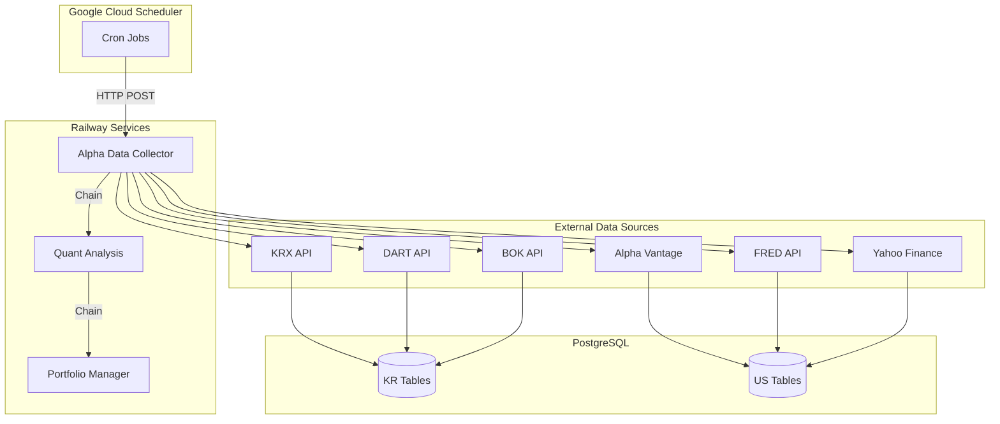
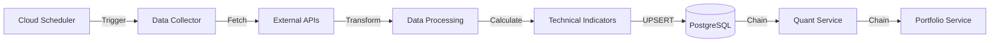
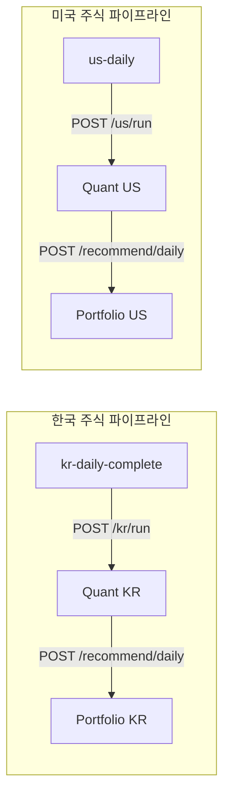

# Data Collector


한국(KOSPI/KOSDAQ) 및 미국(NYSE/NASDAQ) 주식 시장 데이터 자동 수집 및 기술적 지표 계산 시스템

---

## 목차

- [이 저장소의 역할](#이-저장소의-역할)
- [프로젝트 구조](#프로젝트-구조)
- [시스템 아키텍처](#시스템-아키텍처)
- [데이터베이스 설계](#데이터베이스-설계)
- [스케줄링](#스케줄링)
- [서비스 체이닝](#서비스-체이닝)
- [API 엔드포인트](#api-엔드포인트)
- [기술적 특징](#기술적-특징)
- [내부 디렉토리 구조](#내부-디렉토리-구조)
- [기술 스택](#기술-스택)
- [License](#license)

---

## 이 저장소의 역할

전체 프로젝트 중 **데이터 수집 & 지표 계산** 컴포넌트를 담당합니다.

- 한국/미국 주식 시장 데이터 자동 수집 (Cloud Scheduler 기반)
- 기술적 지표 계산 (15종: RSI, MACD, 볼린저밴드, SMA/EMA/WMA, ATR, VWAP, 스토캐스틱, ADX, MFI, CCI, ROC, Aroon, OBV)
- 수집 완료 후 Quant 서비스로 자동 체이닝

---

## 프로젝트 구조

| 저장소 | 설명 | 기술 스택 |
|--------|------|-----------|
| [**api**](https://github.com/vinjung/alphafolio_api) | AI 채팅 백엔드 API | FastAPI, LangGraph, ChromaDB, Fine-tuned GPT |
| [**data**](https://github.com/vinjung/alphafolio_data) | **📍 데이터 자동 수집 & 지표 계산 (현재 저장소)** | FastAPI, asyncpg, Cloud Scheduler |
| [**chat**](https://github.com/vinjung/alphafolio_chat) | AI 비서 개발환경 | LangChain, LangGraph, ChromaDB |
| [**quant**](https://github.com/vinjung/alphafolio_quant) | 멀티팩터 퀀트 분석 엔진 | NumPy, SciPy, hmmlearn |
| [**stock_agent**](https://github.com/vinjung/alphafolio_stock_agent) | 종목 투자 전략 Multi-Agent AI | LangGraph, Task-driven Architecture |
| [**portfolio**](https://github.com/vinjung/alphafolio_portfolio) | 포트폴리오 생성 & 리밸런싱 엔진 | Risk Parity, VaR/CVaR, LangGraph |
---

## 시스템 아키텍처



### 데이터 파이프라인



---

## 데이터베이스 설계

### 공통 테이블

| 테이블 | 설명 | 업데이트 주기 |
|--------|------|--------------|
| `trading_calendar` | 거래일/공휴일 캘린더 (KR/US) | 수동 |
| `market_index` | 시장 지수 (KOSPI/KOSDAQ/NASDAQ/S&P500) | 일 1회 |
| `exchange_rate` | 환율 데이터 | 월 1회 |

### 한국 주식 테이블

| 테이블 | 설명 | 업데이트 주기 |
|--------|------|--------------|
| `kr_stock_basic` | 종목 기본 정보 | 일 1회 |
| `kr_stock_detail` | 종목 상세 정보 | 일 1회 |
| `kr_intraday` | 장중 실시간 시세 | 30분 |
| `kr_intraday_detail` | 장중 상세 정보 | 30분 |
| `kr_intraday_total` | 일간 통합 데이터 | 일 1회 |
| `kr_indicators` | 기술적 지표 | 일 1회 |
| `kr_investor_daily_trading` | 투자자별 매매동향 | 일 1회 |
| `kr_individual_investor_daily_trading` | 개인투자자 매매동향 | 일 1회 |
| `kr_program_daily_trading` | 프로그램 매매동향 | 일 1회 |
| `kr_blocktrades` | 대량매매 내역 | 일 1회 |
| `kr_foreign_ownership` | 외국인 보유현황 | 일 1회 |
| `kr_benchmark_index` | KRX 벤치마크 지수 | 일 1회 |
| `kr_research_reports` | 네이버 리서치 리포트 | 일 1회 |
| `dart_company_info` | DART 기업정보 | 월 1회 |
| `kr_financial_position` | DART 재무상태표 | 분기 |
| `kr_audit` | DART 감사보고서 | 분기 |
| `kr_dividends` | DART 배당정보 | 분기 |
| `kr_largest_shareholder` | DART 최대주주 | 분기 |
| `kr_stockacquisitiondisposal` | DART 자사주 취득/처분 | 분기 |
| `kr_executive` | DART 임원현황 | 분기 |
| `bok_economic_indicators` | 한국은행 경제지표 9종 (기준금리, GDP, 환율, 생산자/소비자/수출/수입물가, 경제심리, 뉴스심리) | 월 1회 |

### 미국 주식 테이블

| 테이블 | 설명 | 업데이트 주기 |
|--------|------|--------------|
| `us_symbol` | Finnhub 심볼 마스터 | 월 1회 |
| `us_stock_basic` | 종목 기본 정보 | 월 1회 |
| `us_daily` | 일간 시세 (OHLCV) | 일 1회 |
| `us_weekly` | 주간 시세 | 수동 |
| `us_monthly` | 월간 시세 | 수동 |
| `us_vwap_base` | VWAP 데이터 | 일 1회 |
| `us_indicators` | 기술적 지표 통합 | 일 1회 |
| `us_rsi`, `us_macd`, `us_bbands` 등 | 개별 기술적 지표 15종 (MACD, BBands, VWAP, ATR, Stoch, MFI, CCI, RSI, ROC, SMA, EMA, ADX, WMA, Aroon, OBV) | 일 1회 |
| `us_income_statement` | 손익계산서 | 분기 |
| `us_balance_sheet` | 재무상태표 | 분기 |
| `us_cash_flow` | 현금흐름표 | 분기 |
| `us_earnings_estimates` | 실적 추정치 | 분기 |
| `us_dividends` | 배당 데이터 | 분기 |
| `us_splits` | 주식 분할 | 분기 |
| `us_news` | 뉴스 데이터 | 일 1회 |
| `us_daily_etf` | ETF 시세 | 일 1회 |
| `us_option` | 옵션 데이터 | 일 1회 |
| `us_option_daily_summary` | 옵션 요약 (GEX 등) | 일 1회 |
| `us_move_index` | MOVE Index | 일 1회 |
| `us_dollar_index` | 달러 인덱스 (FRED: DTWEXBGS) | 일 1회 |
| `us_credit_spread` | 신용 스프레드 (FRED: BAMLC0A0CM) | 일 1회 |
| `us_vix` | VIX 지수 (FRED: VIXCLS) | 일 1회 |
| `us_fed_rrp` | 연준 역레포 (FRED: RRPONTSYD) | 일 1회 |
| `us_gdp` | GDP (FRED: A191RL1Q225SBEA) | 일 1회 |
| `us_pmi` | PMI (FRED: IPMAN) | 일 1회 |
| `us_fed_funds_rate` | 연준 기준금리 | 수동 |
| `us_treasury_yield` | 국채 수익률 | 수동 |
| `us_cpi` | 소비자물가지수 | 수동 |
| `us_unemployment_rate` | 실업률 | 수동 |
| `us_earnings_calendar` | 어닝 캘린더 | 일 1회 |
| `us_insider_transactions` | 내부자 거래 | 일 1회 |
| `us_ipo_calendar` | IPO 캘린더 | 일 1회 |

---

## 스케줄링

### 일일 스케줄 (KST)

```mermaid
gantt
    title 일일 데이터 수집 스케줄 (KST)
    dateFormat HH:mm
    axisFormat %H:%M

    section 한국
    장중 실시간 (30분)     :active, 09:30, 16:00
    일간 마감 데이터        :16:05, 60m

    section 미국
    일간 데이터 (화~토)     :06:05, 180m
```



### Cloud Scheduler 작업 목록

| 작업명 | Cron | 엔드포인트 | 설명 |
|--------|------|-----------|------|
| `kr-intraday` | `*/30 9-15 * * 1-5` | `/collect/kr/intraday` | 장중 30분 간격 |
| `kr-intraday-detail` | `*/30 9-15 * * 1-5` | `/collect/kr/intraday-detail` | 장중 상세 30분 간격 |
| `kr-daily-complete` | `5 16 * * 1-5` | `/collect/kr/daily-complete` | 월~금 16:05 |
| `us-daily` | `5 6 * * 2-6` | `/collect/us/daily` | 화~토 06:05 |
| `us-stock-listing` | `0 0 * * 1` | `/collect/us/stock-listing` | 매주 월요일 00:00 |
| `us-financials-core` | `0 0 * 1,2,4,5,7,8,10,11 0` | `/collect/us/financials-core` | 둘째/넷째주 일요일 |
| `us-ipo-calendar` | `30 23 * * *` | `/collect/us/ipo-calendar` | 매일 23:30 |

### kr-daily-complete 세부 작업 (13개)

| Step | 작업 | 설명 |
|------|------|------|
| 1 | kr_program_daily_trading | 프로그램 매매동향 |
| 2 | kr_blocktrades | 대량매매 내역 |
| 3 | kr_foreign_ownership | 외국인 보유현황 |
| 4 | kr_stock_basic | 종목 기본정보 |
| 5 | kr_stock_detail | 종목 상세정보 |
| 6 | kr_investor_daily_trading | 투자자별 매매동향 |
| 7 | kr_intraday_total | 일간 통합 데이터 |
| 8 | kr_individual_investor_daily_trading | 개인투자자 매매동향 |
| 9 | kr_benchmark_index | KRX 벤치마크 지수 |
| 10 | market_index | 시장 지수 |
| 11 | kr_indicators | 기술적 지표 계산 |
| 12 | bok_indicators | 한국은행 경제지표 |
| 13 | research_crawler | 네이버 리서치 리포트 |

### us-daily 세부 작업 (13개)

| Step | 작업 | 설명 |
|------|------|------|
| 1 | us_daily | 일간 시세 (OHLCV) |
| 2 | us_vwap | VWAP 데이터 |
| 3 | us_news | 뉴스 데이터 |
| 4 | us_daily_etf | ETF 시세 |
| 5 | market_index | 시장 지수 |
| 6 | us_calculator | 기술적 지표 계산 |
| 7 | indicator_recovery | 누락 지표 복구 |
| 8 | us_option | 옵션 데이터 |
| 9 | populate_option_summary | 옵션 요약 (GEX) |
| 10 | us_move_index | MOVE Index |
| 11 | us_fred_macro | FRED 매크로 지표 |
| 12 | us_earnings_calendar | 어닝 캘린더 |
| 13 | insider_transactions | 내부자 거래 |

---

## 서비스 체이닝

데이터 수집 완료 후 자동으로 다음 서비스를 호출합니다.



### 환경변수

| 환경변수 | 설명 | 필수 |
|----------|------|------|
| `DATABASE_URL` | PostgreSQL 접속 URL | O |
| `API_SECRET_KEY` | 서비스 간 인증 키 (X-API-KEY) | O |
| `ALPHAVANTAGE_API_KEY` | Alpha Vantage API 키 | O |
| `DART_API_KEY` | DART 전자공시 API 키 | O |
| `BOK_API_KEY` | 한국은행 API 키 | O |
| `FRED_API_KEY` | FRED 경제 데이터 API 키 | O |
| `FINNHUB_API_KEY` | Finnhub 심볼 API 키 | O |
| `KRX_ID` | KRX 정보데이터시스템 ID | O |
| `KRX_PW` | KRX 정보데이터시스템 PW | O |
| `GCP_SA_KEY` | Google Cloud Service Account 키 | O |
| `QUANT_SERVICE_URL` | Quant 서비스 URL (체이닝용) | - |
| `PORT` | 서버 포트 (기본: 8000) | - |

---

## API 엔드포인트

### Public

| Method | Endpoint | 설명 |
|--------|----------|------|
| GET | `/` | 서버 상태 확인 |
| GET | `/health` | 헬스체크 |

### Protected - 한국 주식 (API Key 필요)

| Method | Endpoint | 설명 |
|--------|----------|------|
| POST | `/collect/kr/intraday` | 장중 실시간 수집 |
| POST | `/collect/kr/intraday-detail` | 장중 상세 수집 |
| POST | `/collect/kr/daily-complete?start_step=1` | 일간 종합 수집 (13개 작업, `start_step`으로 특정 단계부터 재개 가능) |
| POST | `/collect/kr/dart/company-info` | DART 기업정보 |
| POST | `/collect/kr/dart/financial-position` | DART 재무상태표 |
| POST | `/collect/kr/dart/audit` | DART 감사보고서 |
| POST | `/collect/kr/dart/dividends` | DART 배당정보 |
| POST | `/collect/kr/dart/largest-shareholder` | DART 최대주주 |
| POST | `/collect/kr/dart/stock-acquisition` | DART 자사주 취득 |
| POST | `/collect/kr/dart/executive` | DART 임원현황 |

### Protected - 미국 주식 (API Key 필요)

| Method | Endpoint | 설명 |
|--------|----------|------|
| POST | `/collect/us/daily?start_step=1` | 일간 수집 (13개 작업, `start_step`으로 특정 단계부터 재개 가능) |
| POST | `/collect/us/stock-listing` | 종목 리스트 다운로드 |
| POST | `/collect/us/finnhub-symbol` | Finnhub 심볼 수집 |
| POST | `/collect/us/stock-basic` | 종목 기본정보 업데이트 |
| POST | `/collect/us/financials-core` | 핵심 재무제표 3종 병렬 수집 |
| POST | `/collect/us/fed-funds-rate` | 연준 기준금리 |
| POST | `/collect/us/treasury-yield` | 국채 수익률 |
| POST | `/collect/us/cpi` | 소비자물가지수 |
| POST | `/collect/us/unemployment-rate` | 실업률 |
| POST | `/collect/us/dividends-quarterly` | 분기 배당 |
| POST | `/collect/us/earnings-estimates-quarterly` | 분기 실적 추정 |
| POST | `/collect/us/ipo-calendar` | IPO 캘린더 수집 |

### Admin

| Method | Endpoint | 설명 |
|--------|----------|------|
| POST | `/admin/create-partitions` | DB 파티션 생성 |

---

## 기술적 특징

<details>
<summary><b>거래일 자동 판단</b></summary>

- `trading_calendar` 테이블 기반 공휴일/주말 자동 스킵
- 적용 대상: `kr/daily-complete`, `kr/intraday`, `kr/intraday-detail`, `us/daily`
- KR/US 시장별 독립 판단
- Fail-open 정책: 캘린더 데이터 없거나 DB 에러 시 수집 진행
- 일별 캐시로 중복 조회 방지

</details>

<details>
<summary><b>비동기 처리</b></summary>

- `asyncpg`를 활용한 비동기 데이터베이스 연결
- `aiohttp`를 통한 비동기 HTTP 요청
- Connection Pool 관리 (모듈별 min=1~10, max=3~50 차등 설정)
- Pipeline 패턴: API Worker + DB Worker 병렬 처리

</details>

<details>
<summary><b>PostgreSQL 최적화</b></summary>

- Window Function을 활용한 이동평균 계산
- 파티션 테이블로 대용량 데이터 관리
- UPSERT (ON CONFLICT) 패턴으로 중복 처리
- COPY 명령어를 활용한 대량 INSERT

</details>

<details>
<summary><b>성능 설정</b></summary>

| 모듈 | 설정 | 값 |
|------|------|------|
| KR Calculator | DB 커넥션 풀 | min=10, max=50, timeout=120s |
| US Calculator | 동시 배치 | max_concurrent_batches=40 |
| Alpha Vantage | 호출 간격 | 0.2s (300 calls/min), 재무제표 0.6s (100 calls/min) |
| 서비스 체이닝 | Quant 호출 타임아웃 | 7,200s (2시간) |

</details>

<details>
<summary><b>API Rate Limiting 대응</b></summary>

- API별 호출 간격 조절 (Alpha Vantage: 300 calls/min = 0.2s interval)
- **재시도 로직**: 실패 시 최대 2회 추가 재시도
  - 1차 패스 완료 후 실패 심볼 수집
  - 3초 대기 후 재시도 (retry round 1)
  - 여전히 실패 시 3초 대기 후 재시도 (retry round 2)
  - 최종 실패 심볼 로그 기록
- 일일 한도 초과 시 자동 중단

</details>

<details>
<summary><b>수집 이력 관리</b></summary>

- JSON 기반 수집 로그 (`/app/log/*.json`)
- 중복 수집 방지 (CollectionLogger)
- 부분 실패 시 복구 지원
- DB 기반 skip 로직 (재무제표)

</details>

<details>
<summary><b>Deadline 관리</b></summary>

- 재무제표 수집: 당일 23:59:59 자동 종료
- Cloud Scheduler attempt_deadline 설정 필요

</details>

---

## 내부 디렉토리 구조

```
alpha/data/
├── main.py                     # FastAPI 서버 진입점
├── requirements.txt            # 의존성 패키지
│
├── kr/                         # 한국 주식 데이터 수집
│   ├── krx.py                  # KRX(한국거래소) 데이터 수집
│   ├── krx_index.py            # KRX 지수 데이터 수집
│   ├── dart.py                 # DART(전자공시) 재무제표
│   ├── dart_financial.py       # DART 재무 상세 정보
│   ├── bok.py                  # 한국은행 경제지표
│   ├── bok_local.py            # 한국은행 경제지표 (로컬 실행용)
│   ├── kr_calculator.py        # 기술적 지표 계산
│   ├── research_crawler.py     # 리서치 리포트 크롤링
│   └── gcs_handler.py          # Google Cloud Storage 연동
│
├── us/                         # 미국 주식 데이터 수집
│   ├── alphavantage.py         # Alpha Vantage API (Daily, VWAP, Weekly, Monthly, IPO Calendar)
│   ├── finance_data.py         # 재무제표 수집 (Income, Balance, CashFlow, Earnings, Insider 등)
│   ├── us_calculator.py        # 기술적 지표 계산
│   ├── us_stock_basic.py       # 종목 기본정보 업데이트
│   ├── us_etf.py               # ETF 데이터 수집
│   ├── us_news.py              # 뉴스 데이터 수집
│   ├── us_option.py            # 옵션 데이터 수집
│   ├── populate_option_summary.py  # 옵션 요약 계산
│   ├── indicator_recovery.py   # 누락 지표 복구
│   ├── stock_listing_downloader.py # 종목 리스트 다운로드
│   ├── finnhub_symbol.py       # Finnhub 심볼 수집
│   ├── us_fred_macro_collector.py  # FRED 매크로 지표
│   └── us_move_index_collector.py  # MOVE Index 수집
│
├── index/                      # 시장 지수
│   └── index.py                # KOSPI/KOSDAQ/NASDAQ/S&P500
│
└── utils/                      # 유틸리티
    ├── auth.py                 # API 키 인증
    ├── schedule_helper.py      # 스케줄 체크 & 거래일 판단
    └── partition_manager.py    # DB 파티션 관리
```

---

## 기술 스택

| 구분 | 기술 |
|------|------|
| **Language** | Python 3.11+ |
| **Framework** | FastAPI |
| **Database** | PostgreSQL (asyncpg) |
| **Server** | Railway |
| **Scheduler** | Google Cloud Scheduler |
| **Authentication** | API Key (X-API-KEY Header) |

<details>
<summary><b>주요 라이브러리</b></summary>

```
fastapi, uvicorn           # Web Framework & ASGI Server
asyncpg, psycopg2          # PostgreSQL Drivers
pandas, numpy              # Data Processing
aiohttp, httpx             # HTTP Clients (async)
requests                   # HTTP Client (sync)
beautifulsoup4             # Web Scraping
finance-datareader         # Market Index Data
yfinance                   # Yahoo Finance API
fredapi                    # FRED Economic Data
google-cloud-storage       # GCS Integration
google-auth                # Google Cloud 인증
pandas-market-calendars    # 시장 거래일 캘린더
python-dotenv              # 환경변수 관리
python-dateutil, pytz      # 날짜/시간대 처리
```

</details>

---

## ⚠️ **사업 코드 - 제한적 공개**

🚫 **상업적 사용 / 수정 / 재배포 엄격 금지**
⏰ **임시 공개 후 Private 전환 예정**
👁️ **참고용으로만 사용하세요**

## License
[CC BY-NC-ND 4.0](https://creativecommons.org/licenses/by-nc-nd/4.0/)
